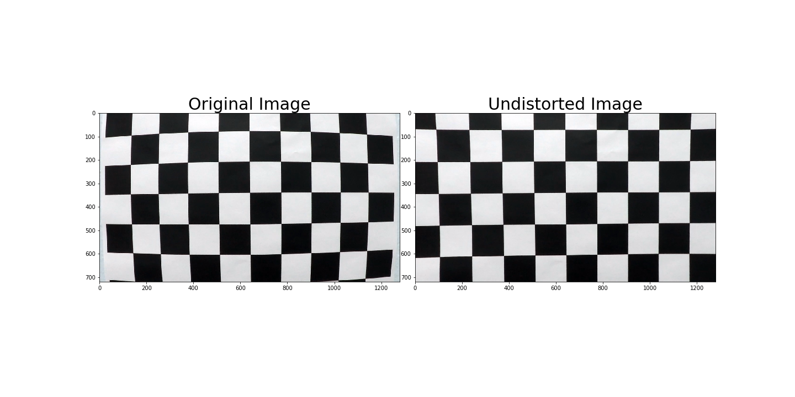
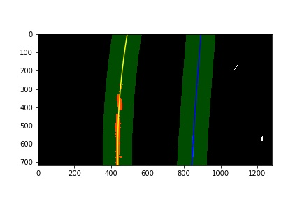

# Self-Driving Car Engineer Nanodegree Program
## Advanced Lane Finding Project

The goals / steps of this project are the following:

* Compute the camera calibration matrix and distortion coefficients given a set of chessboard images.
* Apply a distortion correction to raw images.
* Use color transforms, gradients, etc., to create a thresholded binary image.
* Apply a perspective transform to rectify binary image ("birds-eye view").
* Detect lane pixels and fit to find the lane boundary.
* Determine the curvature of the lane and vehicle position with respect to center.
* Warp the detected lane boundaries back onto the original image.
* Output visual display of the lane boundaries and numerical estimation of lane curvature and vehicle position.


## [Rubric](https://review.udacity.com/#!/rubrics/571/view) Points
*Addressing each point in the project implementation with respect to the Rubric.*

---
### Writeup / README

#### 1. Provide a Writeup / README that includes all the rubric points and how you addressed each one.  You can submit your writeup as markdown or pdf.  

ReadMe is provided.

### Camera Calibration

#### 1. Briefly state how you computed the camera matrix and distortion coefficients. Provide an example of a distortion corrected calibration image.

The code for this step is contained in the first two code cells of the Jupyter notebook `Advanced Lane Detection.ipynb`.  

The OpenCV functions `findChessboardCorners` and `calibrateCamera` are used for image calibration. A few images of a chessboard are taken from different angles with the same camera are used as input. Arrays of object points,indices of internal corners of a chessboard, and image points(i.e the pixel locations of the internal chessboard corners)  determined by `findChessboardCorners`. camera calibration and distortion coefficients are found by `calibrateCamera` using the image points and object points . OpenCV `undistort` function is used to undo the effects of distortion on any image produced by the same camera. OpenCV function `drawChessboardCorners` is used to visualize the detected data:


Applying `Undistortion`, using the calibration and distortion coefficients, to one of the chessboard images:



### Pipeline (single images)

#### 1. Provide an example of a distortion-corrected image.

Applying `Undistortion` to one of the project test images:


#### 2. Describe how (and identify where in your code) you used color transforms, gradients or other methods to create a thresholded binary image.  Provide an example of a binary image result.

There were several combinations of sobel gradient thresholds and color channel thresholds in multiple color spaces to work with and I finalized to use the
combination of just the L channel of the HLS color space to isolate white lines and the B channel of the LAB colorspace to isolate yellow lines. 
examples of thresholds in the HLS L channel and the LAB B channel:


#### 3. Describe how (and identify where in your code) you performed a perspective transform and provide an example of a transformed image.

my perspective transform is titled "Perspective Transform".
The `ImageUnwarp()` function takes as inputs an image (`InputImage`), as well as source (`SourcePoints`) and destination (`DestinationPoints`) points.  
I had tried the ROI pyramid approach like the Project 1(basic Lane Detection) but however it didnt
work out for the current requirement,so i have hardcoded the source and destination points :

The results of the perspective transform: 


#### 4. Describe how (and identify where in your code) you identified lane-line pixels and fit their positions with a polynomial?

The functions `SlidingWindowPolyfit` and `Polyfit_PreviousData`, which identify lane lines and fit a second order polynomial to both right and left lane lines,  
The first of these computes a histogram of the bottom half of the image and finds the bottom-most x position of the left and right lane lines. 
I evaluate the quarters of the histogram just left and right of the midpoint to reject lines from adjacent lanes. 
The function then identifies nine windows from which to identify lane pixels,  
Pixels belonging to each lane line are identified and the Numpy `polyfit()` method fits a second order polynomial to each set of pixels. 

This is the histogram generated by `SlidingWindowPolyfit`; 
base points for the left and right lanes are the two peaks nearest the center:


SlidingWindow visualization


The `Polyfit_PreviousData` function performs basically the same task, 
but its applies it over a previous fit (i.e from a previous video frame)
and only searching for lane pixels within a certain range of that fit. 


#### 5. Describe how (and identify where in your code) you calculated the radius of curvature of the lane and the position of the vehicle with respect to center.

```
LeftCurveRadius = ((1 + (2*LeftFitCurve[0]*Y_Eval*Yaxis_MetersPerPixel + LeftFitCurve[1])**2)**1.5) / np.absolute(2*LeftFitCurve[0])
```
`LeftFitCurve[0]` is the first coefficient (the y-squared coefficient) of the second order polynomial fit, 
and `LeftFitCurve[1]` is the second (y) coefficient. 
`Y_Eval` is the y position within the image upon which the curvature calculation is based.
`Yaxis_MetersPerPixel` is the factor used used to generate a new fit with coefficients in terms of meters. 

The position of the vehicle with respect to the center of the lane is calculated with the following lines of code:
```
LaneCenterPosition = (RightFit_Xint + LeftFit_Xint) /2
CenterDistance = (car_position - LaneCenterPosition) * Xaxis_MetersPerPixel
```
`RightFit_Xint` and `LefttFit_Xint` are the x-intercepts of the right and left fits, respectively. 


#### 6. Provide an example image of your result plotted back down onto the road such that the lane area is identified clearly.

I implemented this step in the code cells titled "Draw the Detected Lane Back onto the Original Image" 
and "Draw Curvature Radius and Distance from Center Data onto the Original Image" in the Jupyter notebook. 
A polygon is generated based on plots of the left and right fits, 
warped back to the perspective of the original image using the inverse perspective matrix `InverseTransformationMatrix` and overlaid onto the original image. 
The image below is an example of the results of the `Drawlane` function:


Below is an example of the results of the `DrawLaneWithData` function, 
which writes text identifying the curvature radius and vehicle position data onto the original image:


---

### Pipeline (video)

#### 1. Provide a link to your final video output.  Your pipeline should perform reasonably well on the entire project video (wobbly lines are ok but no catastrophic failures that would cause the car to drive off the road!).

[link to the video result output](./project_video_output.mp4)

### Discussion

#### 1. Briefly discuss any problems / issues you faced in your implementation of this project.  Where will your pipeline likely fail?  What could you do to make it more robust?

Problems encountered: 
-lighting conditions
-shadows 
-curvy roads
-unstable pitch(ups and downs on the road)
- unstable lane width
Initially i have considered using the gradient information for detecting lanes but i had to discard that due to too much noisy content on the output.
Then i have switched to L channel of the HLS color space to isolate white lines and the B channel of the LAB colorspace to isolate yellow lines.

considerations for making my algorithm more robust:
-Implementing a state machine which could keep track of the previously detected lanes and their behaviour pattern.
-Processing a resized(interpolated image) to reduce the processing time.(need to experiment to find the drawbacks)
-processing alternate frames to reduce the runtime of the algorithm.
